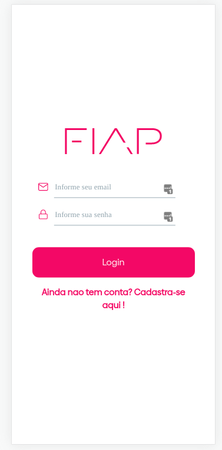
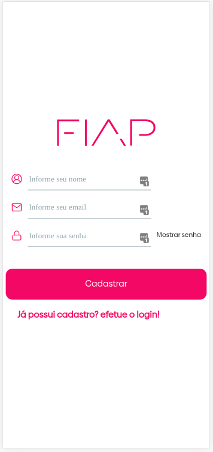

# Task Manager - Fiap - Vinícius Komninakis - 78AOJ

> Projeto feito durante as aulas de Front-end e UX, para gerenciamento de tarefas, contendo login, cadastramento, criação de tarefas, edição, conclusão e remoção, junto de filtragem.

## Setup

### Pré requesitos

1. ⚙️ - Nodejs >= 14.15.0.
2. 🗄️ - MongoDB.

É preciso também adicionar as variáveis de ambiente no arquivo `.env`, consultar `.env.example` para ver quais são necessárias.

### Rodando

1. `npm i`.
2. `npm run dev`.

## Imagens

> Algumas imagens demonstrativas de como ficou o projeto finalizado

### Tela de login:

  

### Tela de cadastro:

  

### Tela de tarefas:

  

### Video de cadastramento !!!!

  

